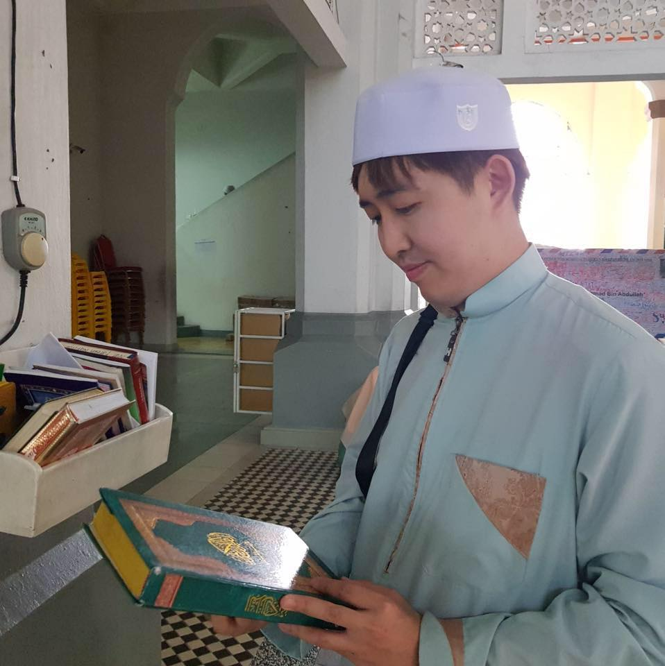

|발표형태|이름|소속|제목|발표 소개|
|:--------:|:-----------------:|:-----------:|:--------:|:--------:|
|키노트|서희|LG전자|데이터 사이언티스트가 인공지능 서비스(Chatbot)를 오픈하는 방법(챗봇과 텍스트 마이닝)|본 세션은 지난 1년간 챗봇 서비스 오픈 통해 경험한 내용을 공유하고 자연어 처리 관점에서 상용 서비스를 위한 핵심요소들을 설명합니다. 마지막으로 텍스트 분석 방법을 통해 효율적인 챗봇 설계와 운영방법을 설명합니다.|
|키노트|임재수|카카오|khaiii - 딥러닝 기반 형태소 분석기|카카오의 딥러닝 기반 형태소 분석기 khaiii에 대해 소개를 드립니다. **대상** : RNN, CNN 등 딥러닝 기술을 이용해 품사 태깅, 개체명 인식 등의 NLP 문제를 해결해 보신 분|
|튜토리얼|이광춘|Tidyverse Korea|유튜브 댓글 텍스트 분석|유튜브 API를 통해 유튜브 채널, 동영상, 댓글을 수집하는 방법과 탐색적 데이터 분석을 통해 유튜브 채널 활동지표를 이해하고 댓글을 추출하여 가장 인기있는 댓글러를 찾아보고 자연어 처리를 통해 추가로 텍스트에 숨겨진 깊은 뜻을 함께 찾아봅니다. **대상** : 중급|  
|튜토리얼|최태균|모두의 연구소 DeepNLP랩| 텐서플로우로 시작하는 텍스트 분류|**1.** 텐서플로우 에스티메이터 기능과 네이버 영화 평점 데이터를 활용하여 텍스트 분류모델을 쉽게 만들어 보아요. **2.** 다음과 같은 내용에 대해서 학습하실 수 있습니다. - 학습 데이터를 어떻게 가공하는지를 알아봅니다. - 텐서플로우 에스티메이터를 어떻게 다루는지 알아봅니다. - 텍스트 분류를 위한 딥러닝 모델을 알아봅니다. **3.** 위 강의는 '텐서플로우와 머신러닝으로 시작하는 자연어처리 (부제: 로지스틱부터 트렌스포머까지)' 를 바탕으로 내용구성이 됩니다. 4. 파이썬과 주피터 노트북을 다루실 줄 아시는 분일 수록 배우시기 편합니다. **대상** :  개발레벨은 초,중급 수준이고 텐서플로우로 텍스트 분류 모델을  간단하게 만들고자 하는 분들게 권하는 튜토리얼입니다.|     
|튜토리얼|박조은|전업으로 육아를 하며 틈틈이 파이썬으로 분석과 개발을 합니다.|청와대 국민청원 데이터로 파이썬 자연어처리 입문하기|지난해 파이콘에서 진행했던 튜토리얼을 다시 진행합니다.
1년 치 국민청원 텍스트 데이터를 전처리, 분석, 시각화(워드 클라우드, 단어 유사도) 해봅니다. 전처리한 텍스트를 바탕으로 평균보다 높은 투표수를 얻을지 낮은 투표수를 얻을지 머신러닝을 통해 예측해 봅니다. 또, 텍스트를 통해 어느 카테고리에 해당하는 내용인지도 예측해 봅니다.Colaboratory 사용을 위한 구글 이메일 주소와 개인 노트북이 필요합니다. [튜토리얼 노트북 참고](https://github.com/corazzon/petitionWrangling)
|       
|스피커|이재석|SEnE|자연어처리가 뭔가요? 왜 회사들에서 관심을 가지나요?| 이제 처음으로 자연어처리라는 것을 들으신 분들에게  어떻게 공부하고 무엇을 공부하면 좋을지 생각하는 시간을 갖고자 합니다. 자연어처리 입문에 도움이 되도록 설명을 위한 이미지와 동영상을 많이 준비하고 있습니다. 누구라도 자연어처리를 하는 세상이 빨리 왔으면 좋겠습니다. **대상** : 초급(문과, 비개발))|                 
|스피커|박혜웅|SK플래닛|DIY 챗봇|챗봇 프레임워크와 딥러닝  없이, 나만의 챗봇을 만들 수 있는 방법에 대해 알아봅니다. 대화 관리(Dialogue Manager)와 자연어 이해(NLU)를 위주로 설명합니다. **대상** : 개발자 + 초급|
|스피커|심상진|심플랙스컴플랙서티그룹운영자|한국어 의존성 분석을 위한 이론 및 동향|한국어 의존성 분석을 위한 동향 및 이론들을 알아본다 **대상** : 중급| 
|스피커|우종하|챗봇 개발자 모임 페이스북 그룹 운영자|사례 중심으로 본 감성챗봇의 미래|감성챗봇의 현황과 제품 소개 및 특징 분석  **대상 : 초급**|
|스피커|고재선|법무법인 신율|트랜스퍼 러닝과 텍스트 문서의 분류|트랜스퍼 러닝을 텍스트 문서 분류에 적용하는 방법을 간략히 소개합니다. 주요 내용 : **1.** 트랜스퍼 러닝, 문서 분류의 각 일반론 **2.** 소스와 타겟의 분포가 다를 경우의 트랜스퍼 러닝 적용(예컨대, 소스에는 중복되는 클래스가 적고, 타겟에는 중복 클래스가 많은 경우) **3.** 소스와 타겟의 도메인 자체가 다를 경우의 트랜스퍼 러닝 적용(예컨대, 소스는 뉴스이고, 타겟은 영화 리뷰일 경우) **대상** : 초급 ~ 중급|
|스피커|김정아|서울대 국문과|대화와 화행|최근의 NLP는 단순히 문장을 분석하는 단계를 넘어 대화 등의 복잡한 단위를 분석하는 단계로 넘어가고 있습니다. 그렇다면 대화라는 단위에 대해 언어학에서는 어떻게 바라보고 있는지, 가장 중요한 개념 중 하나인 화행을 바탕으로 하여 설명하는 발표입니다. 화행의 개념과 종류, 그 중요성, 그리고 실제 언어에서 화행이 어떻게 나타나는지 분석의 어려움은 무엇인지까지 함께 이야기하고자 합니다. **대상** : 언어학, 국어학 학부 수준의 내용으로 해당 영역에 초급 수준이면 들을 수 있는 발표입니다.|

# 행사 진행

|:--------:|:-----------------:|:-----------:|:--------:|:--------:|
|송영숙|이상열|홍수린|송치성|한수미|
|이재석|김성근|심지수|고하경|안유미|
|정민|현예은|김건희|김지인|김도경|
|박신홍[1](./pic/sinhongpark.jpg)|이상규[2](./pic/sangkue.jpg)|||

